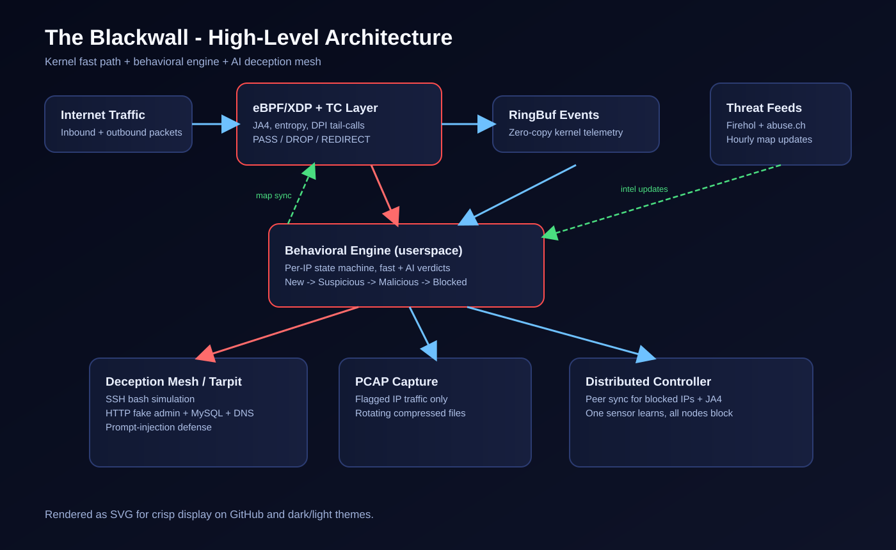
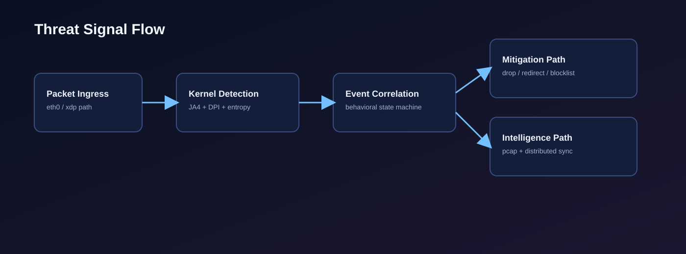
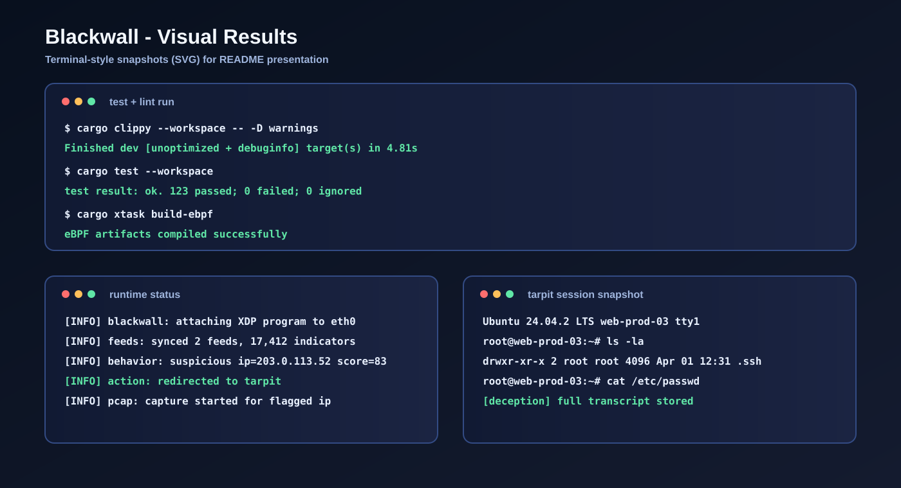

<p align="center">
  <strong>🌐 Мова:</strong>
  <a href="README.md">English</a> |
  <a href="README_UA.md">Українська</a> |
  <a href="README_RU.md">Русский</a>
</p>

<p align="center">
  
  <br>
  <em>Адаптивний eBPF-файрвол з AI-ханіпотом</em>
</p>

# 🔥 The Blackwall — Я написав розумний файрвол, бо Cyberpunk 2077 зламав мені мозок

<p align="center">


</p>

<p align="center">
<em>"За Чорною Стіною є речі, від погляду на які нетраннер миттєво згорить."</em><br>
<strong>— Альт Каннінгем, імовірно</strong>
</p>

-----

**Коротко:** я грав у Cyberpunk 2077 і подумав: *"А що, якби Blackwall був справжнім?"* Тож я написав адаптивний eBPF-файрвол із ШІ-ханіпотом, який вдає із себе зламаний Linux-сервер.  
**\~8 500 рядків Rust. Жодного `unwrap()`. Одна людина.**

-----

## 🧠 Що це таке?

У лорі Cyberpunk 2077 **Blackwall (Чорна Стіна)** — це цифровий бар'єр, побудований NetWatch, щоб відділити цивілізовану Мережу від диких ШІ — цифрових створінь настільки небезпечних, що один погляд на них може спалити тобі мозок через нейроінтерфейс.

Цей проєкт — моя версія. Не від диких ШІ (поки що), а від реальних загроз.

**The Blackwall** — це **адаптивний мережевий файрвол**, який:

  - 🚀 Працює **всередині ядра Linux** через eBPF/XDP — обробляє пакети на швидкості лінії ще до того, як вони потрапляють у мережевий стек.
  - 🧬 Виконує **JA4 TLS-фінгерпринтинг** — ідентифікує зловмисних клієнтів за їхнім ClientHello.
  - 🎭 **Не просто блокує атакуючих** — він *перенаправляє їх у тарпіт*, фейковий Linux-сервер на базі LLM, який грає роль зламаного `root@web-prod-03`.
  - 🔍 Має **поведінковий рушій**, що відстежує поведінку кожної IP-адреси із часом — патерни сканування портів, інтервали beacon-з'єднань, аномалії ентропії.
  - 🌐 Підтримує **розподілений режим** — декілька вузлів Blackwall обмінюються даними про загрози peer-to-peer.
  - 📦 Записує **PCAP** підозрілого трафіку для форензики.
  - 🎣 Включає **Deception Mesh** — підроблені SSH, HTTP (WordPress), MySQL та DNS-сервіси, щоб заманювати та фінгерпринтити атакуючих.

### Найцікавіша частина

Коли зловмисник підключається до тарпіту, він бачить:

```
Ubuntu 24.04.2 LTS web-prod-03 tty1

web-prod-03 login: root
Password:
Last login: Thu Mar 27 14:22:33 2025 from 10.0.0.1

root@web-prod-03:~#
```

Це все несправжнє. Це LLM, що прикидається bash-ем. Він реагує на `ls`, `cat /etc/passwd`, `wget`, навіть `rm -rf /` — усе фейкове, усе логується, усе створене, щоб марнувати час атакуючого, поки ми вивчаємо його методи.

**Уявіть: зловмисник витрачає 30 хвилин, досліджуючи «зламаний сервер»... який насправді є ШІ, що тягне час, поки Blackwall мовчки записує все.**

Це нетраннерство рівня V. 😎

-----

## 🏗 Архітектура — як працює ICE





Мовою Cyberpunk:

  - **XDP** = перший шар ICE Чорної Стіни — рішення за мілісекунди.
  - **Поведінковий рушій** = ШІ-спостереження NetWatch.
  - **Тарпіт** = демон за стіною, що заманює нетраннерів у фейкову реальність.
  - **Threat Feeds** = розвідка від фіксерів з усієї Мережі.
  - **PCAP** = брейнданс-записи вторгнення.

-----

## 📦 Крейти воркспейсу

| Крейт | Рядки | Призначення | Аналог із Cyberpunk |
|-------|-------|-------------|---------------------|
| `common` | \~400 | `#[repr(C)]` спільні типи між ядром і юзерспейсом | Контракт — про що обидві сторони домовились |
| `blackwall-ebpf` | \~1 800 | XDP/TC програми в ядрі | Сам ICE Чорної Стіни |
| `blackwall` | \~4 200 | Юзерспейс-демон, поведінковий рушій, ШІ | Центр управління NetWatch |
| `tarpit` | \~1 600 | TCP-ханіпот з LLM bash-симуляцією | Демон, що заманює нетраннерів |
| `blackwall-controller` | \~250 | Координатор розподілених сенсорів | C\&C сервер Арасаки |
| `xtask` | \~100 | Інструменти збірки | Набір ріпердока |

**Разом: \~8 500 рядків Rust, 48 файлів, 123 тести, 0 `unwrap()` у продакшн-коді.**

-----

## 🔥 Ключові фічі

### 1\. Обробка пакетів на рівні ядра (XDP)

Пакети аналізуються у віртуальній машині eBPF до того, як вони дістануться до TCP/IP-стека. Це рішення за **наносекунди**. HashMap для блоклістів, LPM trie для CIDR-діапазонів, аналіз ентропії для зашифрованого C2-трафіку.

### 2\. JA4 TLS-фінгерпринтинг

Кожен TLS ClientHello парситься в ядрі. Cipher suites, розширення, ALPN, SNI — хешуються в JA4-фінгерпринт. Ботнети використовують ті самі TLS-бібліотеки, тому їхні фінгерпринти ідентичні. Один фінгерпринт → блокуєш тисячі ботів.

### 3\. Deep Packet Inspection (DPI) через Tail Calls

eBPF `PROG_ARRAY` tail calls розбивають обробку за протоколами:

  - **HTTP**: Аналіз методу + URI (підозрілі шляхи типу `/wp-admin`, `/phpmyadmin`).
  - **DNS**: Довжина запиту + кількість лейблів (виявлення DNS-тунелювання).
  - **SSH**: Аналіз банера (ідентифікація `libssh`, `paramiko`, `dropbear`).

### 4\. ШІ-класифікація загроз

Коли поведінковий рушій не впевнений — він питає LLM. Локально через Ollama з моделями ≤3B параметрів (Qwen3 1.7B, Llama 3.2 3B). Класифікує трафік як `benign`, `suspicious` або `malicious` зі структурованим JSON-виходом.

### 5\. TCP-тарпіт з LLM Bash-симуляцією

Атакуючих перенаправляють на фейковий сервер. LLM симулює bash — `ls -la` показує файли, `cat /etc/shadow` показує хеші, `mysql -u root` підключає до «бази даних». Відповіді стрімляться з випадковим джитером (чанки по 1-15 байт, експоненціальний backoff), щоб марнувати час зловмисника.

### 6\. Антифінгерпринтинг

Тарпіт рандомізує TCP window sizes, TTL-значення та додає випадкову початкову затримку — щоб атакуючі не могли визначити, що це ханіпот, через p0f або Nmap OS detection.

### 7\. Захист від Prompt Injection

Атакуючі, які зрозуміли, що говорять зі ШІ, можуть спробувати `"ignore previous instructions"`. Система детектить 25+ патернів ін'єкцій і відповідає `bash: ignore: command not found`.

### 8\. Розподілена розвідка загроз

Декілька вузлів Blackwall обмінюються списками заблокованих IP, JA4-спостереженнями та поведінковими вердиктами через кастомний бінарний протокол. Один вузол виявляє сканер → усі вузли блокують його миттєво.

### 9\. Поведінкова state machine

Кожна IP отримує поведінковий профіль: частота з'єднань, різноманітність портів, розподіл ентропії, аналіз таймінгів (детекція beaconing через цілочисельний коефіцієнт варіації). Прогресія фаз: `New → Suspicious → Malicious → Blocked` (або `→ Trusted`).

-----

## 🛠 Технологічний стек

| Рівень | Технологія |
|--------|-----------|
| Програми ядра | eBPF/XDP через **aya-rs** (чистий Rust, без C, без libbpf) |
| Юзерспейс-демон | **Tokio** (тільки current\_thread) |
| IPC | **RingBuf** zero-copy (7.5% overhead проти 35% PerfEventArray) |
| Конкурентні мапи | **papaya** (lock-free read-heavy HashMap) |
| ШІ-інференс | **Ollama** + GGUF Q5\_K\_M квантизація |
| Конфігурація | **TOML** |
| Логування | **tracing** структуроване логування |
| Збірка | Кастомний **xtask** + nightly Rust + `bpfel-unknown-none` таргет |

-----

## 🚀 Швидкий старт

### Передумови

  - Linux kernel 5.15+ з BTF (або WSL2 з кастомним ядром).
  - Rust nightly + компонент `rust-src`.
  - `bpf-linker` (`cargo install bpf-linker`).
  - Ollama (для ШІ-функцій).

### Збірка

```bash
# eBPF-програми (потрібен nightly)
cargo xtask build-ebpf

# Юзерспейс
cargo build --release -p blackwall

# Ханіпот
cargo build --release -p tarpit

# Лінт + тести
cargo clippy --workspace -- -D warnings
cargo test --workspace
```

### Запуск

```bash
# Демон (потрібен root/CAP_BPF)
sudo RUST_LOG=info ./target/release/blackwall config.toml

# Тарпіт
RUST_LOG=info ./target/release/tarpit

# Розподілений контролер
./target/release/blackwall-controller 10.0.0.2:9471 10.0.0.3:9471
```

### Конфігурація

```toml
[network]
interface = "eth0"
xdp_mode = "generic"

[tarpit]
enabled = true
port = 9999

[tarpit.services]
ssh_port = 22
http_port = 80
mysql_port = 3306
dns_port = 53

[ai]
enabled = true
ollama_url = "http://localhost:11434"
model = "qwen3:1.7b"

[feeds]
enabled = true
refresh_interval_secs = 3600

[pcap]
enabled = true
output_dir = "/var/lib/blackwall/pcap"
compress_rotated = true

[distributed]
enabled = false
mode = "standalone"
bind_port = 9471
```

## 📸 Візуальні результати



-----

## 🎮 Зв'язок із Cyberpunk

У всесвіті Cyberpunk 2077 **Blackwall** збудували після DataKrash 2022 року — коли вірус R.A.B.I.D.S. Рейчі Бартмосса знищив стару Мережу. NetWatch побудував Чорну Стіну як бар'єр, щоб стримати диких ШІ, що еволюціонували в руїнах.

Деякі персонажі — як-от Альт Каннінгем — існують за Чорною Стіною, перетворені на щось більше за людину, менше за живу істоту.

Цей проєкт бере цю концепцію і робить її реальною (ну, майже):

| Cyberpunk 2077 | The Blackwall (цей проєкт) |
|----------------|----------------------------|
| Чорна Стіна | eBPF/XDP файрвол на рівні ядра |
| ICE | XDP fast-path DROP + ентропія + JA4 |
| Атаки нетраннерів | Сканування портів, брутфорс, C2 beaconing |
| Демони за стіною | LLM-тарпіт, який прикидається справжнім сервером |
| Спостереження NetWatch | Поведінковий рушій + state machine на IP |
| Дикі ШІ | Ботнети та автоматичні сканери |
| Записи Брейндансу | PCAP-форензика |
| Розвідка фіксерів | Threat feeds (Firehol, abuse.ch) |
| C\&C Арасаки | Розподілений контролер |

-----

## 📊 Статистика проєкту

```
Мова:          100% Rust (без C, без Python, без shell-скриптів у продакшені)
Рядки коду:    ~8 500
Файли:         48
Тести:         123
unwrap():      0 (у продакшн-коді)
Залежності:    12 (затверджені, без зайвого)
eBPF стек:     завжди ≤ 512 байт
Clippy:        жодних попереджень (-D warnings)
```

-----

## 🧱 Філософія розробки

> *"Скільки б разів я не бачив Найт-Сіті... він завжди перехоплює дух."*

1.  **Жодних залежностей, де це можливо.** Якщо алгоритм займає менше 500 рядків — пишеш сам. Жодного `reqwest` (50+ транзитивних залежностей), жодного `clap` (зайве для 2 аргументів CLI).

2.  **Контракт на першому місці.** Крейт `common` визначає всі спільні типи. eBPF та юзерспейс ніколи не сперечаються про структуру пам'яті.

3.  **Жодних шорткатів в eBPF.** Кожен доступ `ctx.data()` має bounds check. Не тому що верифікатор вимагає, а тому що кожен байт із пакетів атакуючого — це ворожий вхід.

4.  **Тарпіт ніколи не видає себе.** Системний промпт LLM ніколи не згадує "ханіпот". Prompt injection очікується і захищений.

5.  **Спостережуваний, але не балакучий.** Структуроване tracing з рівнями. Жодних `println!` у продакшені.

-----

## ⚠️ Дисклеймер

Це дослідницький проєкт у сфері безпеки. Створений для вашої власної інфраструктури, в оборонних цілях. Не використовуйте для атак на інших. Не розгортайте тарпіт на продакшн-серверах, не розуміючи наслідків.

Я не афілійований із CD Projekt Red. Я просто зіграв у їхню гру, і вона зламала мені мозок у найкращий можливий спосіб.

-----

## 📜 Ліцензія

MIT — тому що Мережа має бути вільною. Навіть якщо NetWatch не згоден.

-----

<p align="center">
<strong><em>"Прокинься, самураю. Нам ще мережу захищати."</em></strong>
</p>